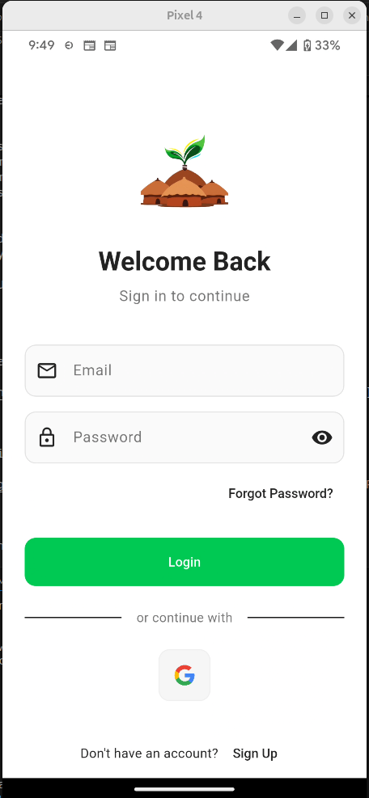
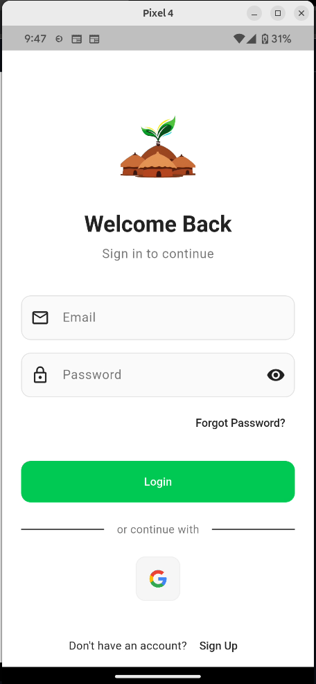
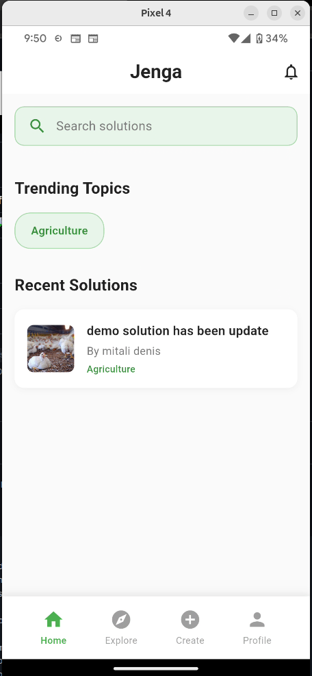
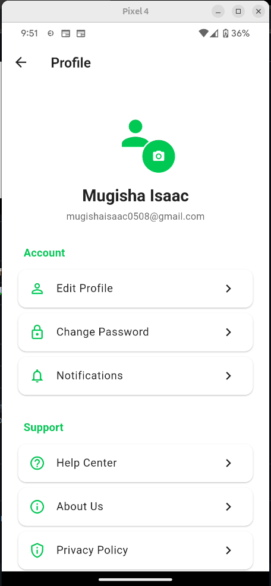
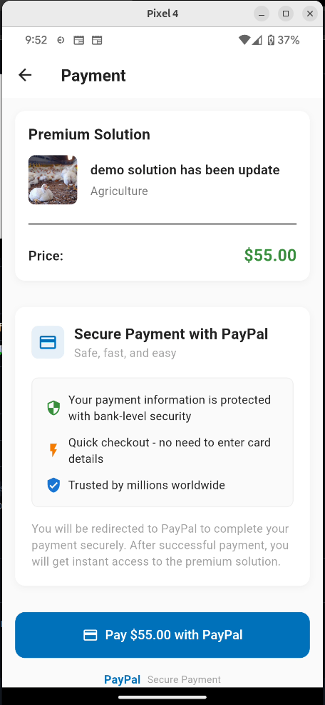
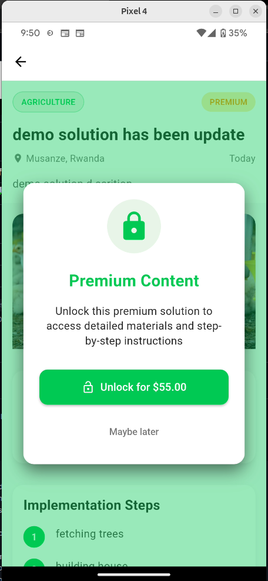
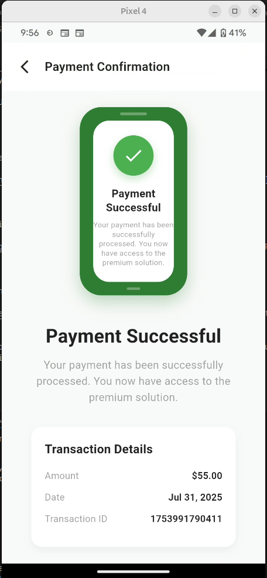
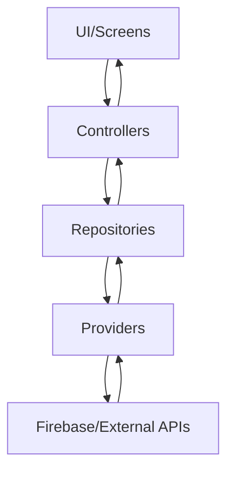

# Jenga App 🏗️

[](https://flutter.dev/)
[](https://firebase.google.com/)
[](https://pub.dev/packages/get)
[](#testing)

A modern Flutter application that connects students and professionals through a knowledge-sharing platform. Built with clean architecture, robust state management, and comprehensive Firebase integration.

## 🚀 Features

### 🔐 Authentication & User Management
- **Email/Password Authentication**: Secure user registration and login
- **Google Sign-In**: Quick authentication with Google accounts
- **Profile Management**: Complete user profile with avatar upload
- **Password Management**: Secure password change functionality

### 📚 Knowledge Sharing Platform
- **Solution Creation**: Create and share educational solutions
- **Premium Content**: Monetized premium solutions with PayPal integration
- **Search & Discovery**: Advanced search and filtering capabilities
- **Categories**: Organized content by subject areas

### 💰 Payment Integration
- **PayPal Integration**: Secure payment processing for premium content
- **Transaction History**: Track all payment transactions
- **Premium Access**: Unlock exclusive content with payments

### 🎨 Modern UI/UX
- **Material Design 3**: Latest Material Design principles
- **Dark/Light Themes**: Automatic and manual theme switching
- **Responsive Design**: Optimized for all screen sizes
- **Smooth Animations**: Polished user interactions

### 🔧 Technical Features
- **Offline Support**: Local data caching and offline functionality
- **Image Upload**: Cloudinary integration for image management
- **Real-time Updates**: Live data synchronization
- **Comprehensive Testing**: Unit, widget, and integration tests

## 📱 Screenshots

### Authentication Flow
| Splash Screen | Welcome Screen | Login Screen |
|:---:|:---:|:---:|
|  |  |  |

### Main App Features
| Home Screen | Solution Detail | Profile Screen |
|:---:|:---:|:---:|
|  |  |  |

### Payment & Premium Content
| Payment Screen | Premium Content | Transaction History |
|:---:|:---:|:---:|
|  |  |  |

> **Note**: Screenshots will be added to the `screenshots/` directory. The app features a modern Material Design 3 interface with smooth animations and intuitive navigation.

## 🏗️ Architecture

## 🏗️ Architecture

This project follows **Clean Architecture** principles with clear separation of concerns:

### 📁 Project Structure

```
lib/
├── 🔗 bindings/              # GetX dependency injection bindings
│   ├── auth_binding.dart     # Authentication dependencies
│   ├── home_binding.dart     # Home screen dependencies
│   └── ...
├── 🎯 mixins/                # Reusable mixins
│   └── safe_controller_mixin.dart
├── 📊 models/                # Data models and entities
│   ├── user.dart            # User model
│   ├── solution.dart        # Solution model
│   ├── payment.dart         # Payment model
│   └── ...
├── 🎮 modules/               # GetX controllers (business logic)
│   ├── auth_controller.dart  # Authentication logic
│   ├── solution_controller.dart
│   ├── payment_controller.dart
│   └── ...
├── 🔌 providers/             # Data providers (Firebase integration)
│   ├── firebase_auth_provider.dart
│   ├── firestore_user_provider.dart
│   └── ...
├── 📦 repositories/          # Data repositories (data abstraction)
│   ├── auth_repository.dart
│   ├── solution_repository.dart
│   └── ...
├── 🛣️ routes/               # App routing configuration
│   ├── routes.dart          # Route constants
│   └── pages.dart           # Route definitions
├── 📱 screens/              # UI screens and pages
│   ├── auth/               # Authentication screens
│   ├── home/               # Home and main screens
│   ├── profile/            # Profile management
│   └── ...
├── 🔧 services/             # External services integration
│   ├── paypal_service.dart  # PayPal payment integration
│   ├── cloudinary_service.dart # Image upload service
│   └── preference_service.dart # Local preferences
├── 🎨 themes/               # App theming
│   └── app_theme.dart
├── 🛠️ utils/                # Utility functions
│   └── logger.dart
├── 🧩 widgets/              # Reusable UI components
└── 📱 main.dart             # App entry point
```

### 🔄 State Management Flow



### 🎯 Key Architectural Principles

- **GetX Pattern**: Reactive state management with dependency injection
- **Repository Pattern**: Clean data abstraction layer
- **Provider Pattern**: External service integration
- **Separation of Concerns**: Each layer has a single responsibility
- **Testability**: All layers are easily testable with mocks

## 🚀 Quick Start

### Prerequisites

- **Flutter SDK**: >= 3.0.0
- **Dart SDK**: >= 3.0.0
- **Android Studio** or **VS Code** with Flutter extensions
- **Firebase CLI** for Firebase configuration
- **Git** for version control

### 1. 📥 Clone the Repository

```bash
git clone https://github.com/Mugisha-isaac/Jenga-App.git
cd Jenga-App
```

### 2. 📦 Install Dependencies

```bash
flutter pub get
```

### 3. 🔥 Firebase Setup

#### Option A: Automatic Setup (Recommended)
```bash
# Install Firebase CLI
npm install -g firebase-tools

# Login to Firebase
firebase login

# Install FlutterFire CLI
dart pub global activate flutterfire_cli

# Configure Firebase for your project
flutterfire configure
```

#### Option B: Manual Setup
1. Create a new Firebase project at [Firebase Console](https://console.firebase.google.com/)
2. Add your Flutter app to the Firebase project
3. Download and add configuration files:
   - **Android**: `google-services.json` → `android/app/`
   - **iOS**: `GoogleService-Info.plist` → `ios/Runner/`
4. Update `lib/firebase_options.dart` with your configuration

### 4. 🔧 Configure Services

#### Firebase Services
Enable the following in your Firebase Console:
- ✅ **Authentication** (Email/Password + Google Sign-In)
- ✅ **Cloud Firestore** (Database)
- ✅ **Storage** (File uploads)

#### Environment Configuration
Create a `.env` file in the root directory:

```env
# PayPal Configuration
PAYPAL_CLIENT_ID_SANDBOX=your_paypal_client_id
PAYPAL_SECRET_SANDBOX=your_paypal_secret_key

# Cloudinary Configuration
CLOUDINARY_CLOUD_NAME=your_cloud_name
CLOUDINARY_API_KEY=your_api_key
CLOUDINARY_API_SECRET=your_api_secret
```

### 5. 🏃‍♂️ Run the App

```bash
# Check for any issues
flutter doctor

# Run on connected device/emulator
flutter run

# Run with flavor (if configured)
flutter run --flavor development
```

## 🛠️ Development Setup

## 🛠️ Development Setup

### Code Style & Analysis

```bash
# Run code analysis
flutter analyze

# Format code
flutter format .

# Check for unused dependencies
flutter pub deps
```

### 🧪 Testing

```bash
# Run all tests
flutter test

# Run tests with coverage
flutter test --coverage

# Run specific test file
flutter test test/auth_test.dart

# Run integration tests
flutter drive --target=test_driver/app.dart
```

### 📱 Building for Production

#### Android
```bash
# Build APK
flutter build apk --release

# Build App Bundle (recommended for Play Store)
flutter build appbundle --release
```

#### iOS
```bash
# Build for iOS
flutter build ios --release
```

## 📋 App Flow & Screens

### 🔐 Authentication Flow
1. **Splash Screen** → App initialization and auth state check
2. **Welcome Screen** → First-time user introduction
3. **Onboarding** → Feature walkthrough for new users
4. **Login/Register** → User authentication
5. **Home Screen** → Main app dashboard

### 🏠 Main App Screens
- **Home**: Dashboard with featured solutions and quick actions
- **Explore**: Browse and search all available solutions
- **Create Solution**: Add new educational content
- **Profile**: User profile management and settings
- **Payment**: Premium content purchase flow
- **Settings**: App preferences and configuration

### 💳 Payment Flow
1. User selects premium solution
2. Payment screen with PayPal integration
3. Secure payment processing
4. Content unlock and access granted
5. Transaction confirmation

## 📚 Dependencies

### 🔧 Core Dependencies
```yaml
dependencies:
  # 🎯 State Management & Navigation
  get: ^4.6.6                    # State management and routing
  
  # 🔥 Firebase Services
  firebase_core: ^2.24.2         # Firebase core functionality
  firebase_auth: ^4.15.3         # Authentication
  cloud_firestore: ^4.13.6       # NoSQL database
  firebase_storage: ^11.6.0      # File storage
  
  # 💰 Payment Integration
  flutter_paypal_payment: ^1.0.6 # PayPal payments
  
  # 🖼️ Image & Media
  image_picker: ^1.0.4           # Image selection
  cached_network_image: ^3.3.0   # Image caching
  
  # 💾 Local Storage
  shared_preferences: ^2.2.2     # Key-value storage
  
  # 🌐 Network & HTTP
  http: ^1.1.0                   # HTTP requests
  dio: ^5.3.2                    # Advanced HTTP client
  
  # 🎨 UI & Animations
  flutter_staggered_animations: ^1.1.1
  shimmer: ^3.0.0                # Loading animations
  
  # 🛠️ Utilities
  flutter_dotenv: ^5.1.0         # Environment variables
  intl: ^0.18.1                  # Internationalization
```

### 🧪 Dev Dependencies
```yaml
dev_dependencies:
  # 🧪 Testing
  flutter_test:
    sdk: flutter
  integration_test:
    sdk: flutter
  mockito: ^5.4.2                # Mocking for tests
  
  # 📊 Code Quality
  flutter_lints: ^3.0.0         # Linting rules
  
  # 🚀 Build Tools
  flutter_launcher_icons: ^0.13.1
  change_app_package_name: ^1.1.0
```

## 🧪 Testing

The app includes comprehensive testing coverage:

### Test Structure
```
test/
├── 🔐 auth_test.dart           # Authentication logic tests
├── 📱 login_widget_test.dart   # Login UI widget tests
├── 📊 models_test.dart         # Data model tests
├── 🛠️ utils_test.dart          # Utility function tests
├── 🔗 widget_integration_test.dart # Integration tests
└── 🧩 widget_test.dart         # General widget tests
```

### Running Tests
```bash
# Run all tests with verbose output
flutter test --reporter=verbose

# Generate coverage report
flutter test --coverage
genhtml coverage/lcov.info -o coverage/html

# Run specific test categories
flutter test test/auth_test.dart
flutter test test/models_test.dart
```

### Test Coverage
- ✅ **Authentication**: Login, registration, password management
- ✅ **User Management**: Profile operations, data validation
- ✅ **Solution Management**: CRUD operations, search functionality
- ✅ **Payment Processing**: PayPal integration, transaction handling
- ✅ **UI Components**: Widget rendering, user interactions

## 🔧 Configuration & Environment

### Firebase Security Rules

#### Firestore Rules
```javascript
rules_version = '2';
service cloud.firestore {
  match /databases/{database}/documents {
    // Users can only access their own user document
    match /users/{userId} {
      allow read, write: if request.auth != null && request.auth.uid == userId;
    }
    
    // Solutions are readable by all authenticated users
    match /solutions/{solutionId} {
      allow read: if request.auth != null;
      allow write: if request.auth != null && 
        (resource == null || resource.data.authorId == request.auth.uid);
    }
    
    // Paid solutions are private to purchaser
    match /paid_solutions/{docId} {
      allow read, write: if request.auth != null && 
        resource.data.userId == request.auth.uid;
    }
  }
}
```

#### Storage Rules
```javascript
rules_version = '2';
service firebase.storage {
  match /b/{bucket}/o {
    match /users/{userId}/{allPaths=**} {
      allow read, write: if request.auth != null && request.auth.uid == userId;
    }
    
    match /solutions/{allPaths=**} {
      allow read: if request.auth != null;
      allow write: if request.auth != null;
    }
  }
}
```

### Environment Variables

Create a `.env` file with the following structure:

```env
# PayPal Configuration
PAYPAL_CLIENT_ID_SANDBOX=sb.YOUR_CLIENT_ID
PAYPAL_SECRET_SANDBOX=YOUR_SECRET_KEY
PAYPAL_ENVIRONMENT=sandbox # or 'production'

# Cloudinary Configuration
CLOUDINARY_CLOUD_NAME=your_cloud_name
CLOUDINARY_API_KEY=your_api_key
CLOUDINARY_API_SECRET=your_api_secret

# App Configuration
APP_NAME=Jenga App
APP_VERSION=1.0.0
DEBUG_MODE=true
```

## 🚀 Deployment

### Android Deployment

1. **Prepare for Release**
```bash
# Generate signing key
keytool -genkey -v -keystore ~/jenga-app-key.jks -keyalg RSA -keysize 2048 -validity 10000 -alias jenga

# Create key.properties file in android/
```

2. **Build Release**
```bash
flutter build appbundle --release
```

3. **Upload to Play Store**
- Use the generated `.aab` file in `build/app/outputs/bundle/release/`

### iOS Deployment

1. **Configure Xcode Project**
```bash
open ios/Runner.xcworkspace
```

2. **Build for Release**
```bash
flutter build ios --release
```

3. **Archive and Upload**
- Use Xcode to archive and upload to App Store Connect

## 🤝 Contributing

We welcome contributions! Please follow these guidelines:

### Development Workflow

1. **Fork the Repository**
```bash
git clone https://github.com/yourusername/Jenga-App.git
cd Jenga-App
```

2. **Create Feature Branch**
```bash
git checkout -b feature/amazing-feature
```

3. **Make Changes**
- Follow the existing code style
- Add tests for new functionality
- Update documentation as needed

4. **Test Your Changes**
```bash
flutter test
flutter analyze
flutter format .
```

5. **Submit Pull Request**
- Provide clear description of changes
- Include screenshots for UI changes
- Reference any related issues

### Code Standards

- **Dart Style Guide**: Follow [effective Dart](https://dart.dev/guides/language/effective-dart)
- **File Naming**: Use `snake_case` for file names
- **Class Naming**: Use `PascalCase` for class names
- **Variable Naming**: Use `camelCase` for variables and functions
- **Comments**: Document complex logic and public APIs

### Commit Convention

```
feat: add new payment integration
fix: resolve authentication timeout issue
docs: update README with setup instructions
style: format code according to guidelines
refactor: restructure user repository
test: add unit tests for auth controller
```

## 📄 License

This project is licensed under the MIT License - see the [LICENSE](LICENSE) file for details.

```
MIT License

Copyright (c) 2025 Jenga App Team

Permission is hereby granted, free of charge, to any person obtaining a copy
of this software and associated documentation files (the "Software"), to deal
in the Software without restriction, including without limitation the rights
to use, copy, modify, merge, publish, distribute, sublicense, and/or sell
copies of the Software, and to permit persons to whom the Software is
furnished to do so, subject to the following conditions:

The above copyright notice and this permission notice shall be included in all
copies or substantial portions of the Software.

THE SOFTWARE IS PROVIDED "AS IS", WITHOUT WARRANTY OF ANY KIND, EXPRESS OR
IMPLIED, INCLUDING BUT NOT LIMITED TO THE WARRANTIES OF MERCHANTABILITY,
FITNESS FOR A PARTICULAR PURPOSE AND NONINFRINGEMENT.
```


## 🙏 Acknowledgments

- **Flutter Team** for the amazing framework
- **Firebase** for backend services
- **GetX** for state management
- **Material Design** for design guidelines
- **Open Source Community** for inspiration and packages

---

<div align="center">
Made with ❤️ by the Jenga App Team
</div>
